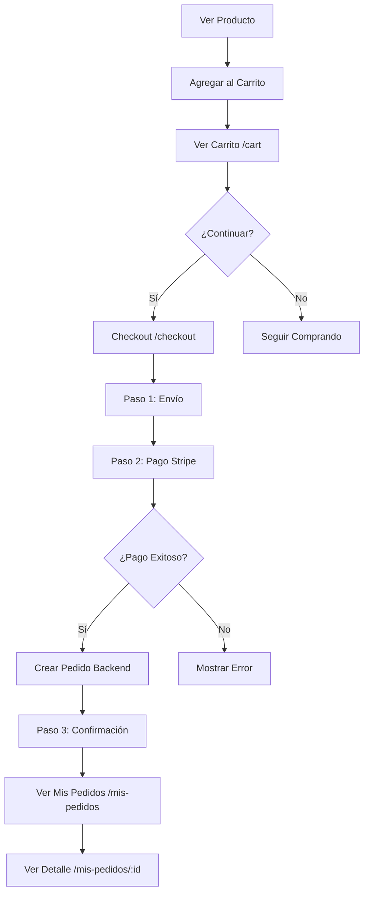

# 🛒 Sistema de Carrito, Checkout y Pedidos - Cliente

## 📋 Descripción General

Sistema completo de e-commerce para clientes con carrito de compras, procesamiento de pagos con Stripe, y gestión de pedidos.

## 🏗️ Arquitectura

### **Frontend**
```
frontend/src/
├── context/
│   └── CartContext.tsx                 # Estado global del carrito
├── services/
│   └── carritoService.ts               # API del carrito
├── pages/client/
│   ├── carrito/
│   │   └── carrito.page.tsx            # Página del carrito
│   ├── checkout/
│   │   ├── checkout.page.tsx           # Proceso de checkout
│   │   └── components/
│   │       ├── shipping-form.tsx       # Formulario de envío
│   │       ├── checkout-form.tsx       # Formulario de pago (Stripe)
│   │       └── order-summary.tsx       # Resumen del pedido
│   └── mis-pedidos/
│       ├── mis-pedidos.page.tsx        # Lista de pedidos
│       └── pedido-detalle.page.tsx     # Detalle de un pedido
```

### **Backend**
- **App**: `carrito` - Gestión del carrito de compras
- **App**: `ventas` - Gestión de pedidos
- **App**: `pagos` - Integración con Stripe

---

## 🛍️ Funcionalidades

### 1. **Carrito de Compras** (`/cart`)

#### **Características:**
- ✅ Visualización de productos en el carrito
- ✅ Actualizar cantidad de productos (con validación de stock)
- ✅ Eliminar productos individualmente
- ✅ Vaciar todo el carrito
- ✅ Cálculo automático de totales
- ✅ Badge en navbar con contador de items
- ✅ Persistencia en backend (requiere autenticación)
- ✅ Navegación a checkout

#### **Context: CartContext**

**Estado Global:**
```typescript
{
  carrito: Carrito | null;
  loading: boolean;
  itemsCount: number;
}
```

**Métodos:**
```typescript
agregarProducto(productoId: number, cantidad?: number): Promise<void>
actualizarCantidad(itemId: number, cantidad: number): Promise<void>
eliminarItem(itemId: number): Promise<void>
vaciarCarrito(): Promise<void>
refrescarCarrito(): Promise<void>
```

**Uso:**
```tsx
import { useCart } from '@/context/CartContext';

const { carrito, itemsCount, agregarProducto } = useCart();

// Agregar producto
await agregarProducto(productoId, 2);

// Mostrar contador
<span>{itemsCount}</span>
```

#### **API Endpoints:**
```
GET    /api/carrito/                          # Obtener carrito actual
POST   /api/carrito/agregar/                  # Agregar item
PATCH  /api/carrito/items/{id}/actualizar/    # Actualizar cantidad
DELETE /api/carrito/items/{id}/eliminar/      # Eliminar item
DELETE /api/carrito/vaciar/                   # Vaciar carrito
```

---

### 2. **Checkout** (`/checkout`)

Proceso de compra en 3 pasos con wizard:

#### **Paso 1: Información de Envío**
- Formulario con React Hook Form
- Validaciones en tiempo real
- Campos: nombre, email, teléfono, dirección completa, notas

#### **Paso 2: Pago con Stripe**
- Integración con Stripe Elements
- CardElement para ingresar tarjeta
- Creación automática de Payment Intent
- Confirmación de pago
- Resumen de dirección de envío
- Botón "Volver" para editar datos

#### **Paso 3: Confirmación**
- Mensaje de éxito
- Botones para ver pedidos o seguir comprando
- Carrito automáticamente vaciado

#### **Componentes:**

**ShippingForm:**
```tsx
<ShippingForm onSubmit={(data) => handleShippingSubmit(data)} />
```

**CheckoutForm (con Stripe Elements):**
```tsx
<Elements stripe={stripePromise}>
  <CheckoutForm
    shippingData={shippingData}
    onSuccess={handlePaymentSuccess}
    onBack={() => setCurrentStep('shipping')}
  />
</Elements>
```

**OrderSummary:**
```tsx
<OrderSummary carrito={carrito} />
```

#### **Flujo de Pago:**

1. **Crear Payment Intent:**
```typescript
POST /api/pagos/create-payment-intent/
Response: { client_secret: "pi_xxx_secret_xxx" }
```

2. **Confirmar Pago (Stripe):**
```typescript
const { error, paymentIntent } = await stripe.confirmCardPayment(
  clientSecret,
  {
    payment_method: {
      card: cardElement,
      billing_details: { ... }
    }
  }
);
```

3. **Crear Pedido:**
```typescript
POST /api/ventas/pedidos/
{
  direccion_envio: { ... },
  notas_cliente: "...",
  metodo_pago: "stripe",
  transaction_id: "pi_xxx"
}
```

#### **Tarjetas de Prueba (Stripe Test Mode):**
```
Número: 4242 4242 4242 4242
MM/YY: cualquier fecha futura
CVC: cualquier 3 dígitos
ZIP: cualquier código postal
```

---

### 3. **Mis Pedidos** (`/mis-pedidos`)

#### **Lista de Pedidos:**
- Visualización de todos los pedidos del usuario
- Badge con estado del pedido (colores por estado)
- Información: número, fecha, total, cantidad de productos
- Dirección de envío resumida
- Botones:
  - "Ver Detalles" → `/mis-pedidos/{id}`
  - "Rastrear Envío" (solo para estado ENVIADO)

#### **Detalle de Pedido** (`/mis-pedidos/{id}`)
- Layout en 2 columnas
- **Columna principal:**
  - Lista de productos con imágenes
  - Dirección de envío completa
  - Notas del cliente
- **Columna lateral:**
  - Resumen de pago (subtotal, descuento, envío, impuestos, total)
  - Información de pago
  - Fechas importantes (creado, enviado, entregado)

#### **Estados de Pedidos:**

```typescript
enum EstadoPedido {
  PENDIENTE = 'PENDIENTE',       // Amarillo
  PAGADO = 'PAGADO',             // Verde
  CONFIRMADO = 'CONFIRMADO',     // Azul
  PREPARANDO = 'PREPARANDO',     // Púrpura
  ENVIADO = 'ENVIADO',           // Índigo
  ENTREGADO = 'ENTREGADO',       // Esmeralda
  CANCELADO = 'CANCELADO',       // Rojo
}
```

#### **API Endpoints:**
```
GET /api/ventas/pedidos/mis_pedidos/       # Lista de pedidos del usuario
GET /api/ventas/pedidos/{id}/detalle/      # Detalle de un pedido
GET /api/ventas/pedidos/{id}/rastrear/     # Timeline del pedido
```

---

## 🔧 Configuración

### **1. Variables de Entorno**

**Frontend** (`.env`):
```env
VITE_API_URL=http://localhost:8000
VITE_STRIPE_PUBLISHABLE_KEY=pk_test_51QN...
```

**Backend** (`.env` o `settings.py`):
```env
STRIPE_SECRET_KEY=sk_test_51QN...
STRIPE_PUBLISHABLE_KEY=pk_test_51QN...
```

### **2. Instalación de Dependencias**

**Frontend:**
```bash
npm install @stripe/stripe-js @stripe/react-stripe-js
```

**Backend:**
```bash
pip install stripe
```

### **3. Configuración de Stripe**

1. Crear cuenta en [Stripe](https://stripe.com)
2. Obtener API keys en modo test
3. Configurar webhook (opcional para producción):
   - URL: `https://tu-dominio.com/api/pagos/webhook/`
   - Eventos: `payment_intent.succeeded`, `payment_intent.payment_failed`

---

## 🎨 Componentes UI Utilizados

### **Shadcn UI:**
- `Card`, `CardContent`, `CardHeader`, `CardTitle`
- `Button`
- `Badge`
- `Separator`
- `Input`, `Label`, `Textarea`
- `Alert`, `AlertDescription`
- `AlertDialog` (confirmaciones)

### **Lucide Icons:**
- `ShoppingCart`, `Package`, `CreditCard`, `MapPin`
- `Trash2`, `Plus`, `Minus`, `Eye`, `ArrowLeft`
- `CheckCircle2`, `Loader2`, `AlertCircle`

---

## 📊 Flujo Completo de Compra



---

## 🔐 Autenticación y Permisos

### **Rutas Protegidas:**
- `/cart` - Requiere login
- `/checkout` - Requiere login
- `/mis-pedidos` - Requiere login
- `/mis-pedidos/:id` - Requiere login (solo pedidos propios)

### **API Endpoints:**
```python
# Backend: ventas/views.py
class PedidoViewSet(viewsets.ModelViewSet):
    def get_permissions(self):
        if self.action in ['list', 'actualizar_estado']:
            return [IsAdminUser()]  # Solo admin
        elif self.action in ['create', 'mis_pedidos', 'detalle']:
            return [IsAuthenticated()]  # Usuario logueado
        return [AllowAny()]
```

---

## 🧪 Testing

### **Casos de Prueba:**

1. **Carrito:**
   - ✅ Agregar producto con cantidad
   - ✅ Actualizar cantidad (validar stock máximo)
   - ✅ Eliminar producto con confirmación
   - ✅ Vaciar carrito completo
   - ✅ Badge actualiza en navbar

2. **Checkout:**
   - ✅ Validación de formulario de envío
   - ✅ Pago con tarjeta de prueba
   - ✅ Creación de pedido en backend
   - ✅ Redirección a confirmación
   - ✅ Carrito vaciado después de compra

3. **Mis Pedidos:**
   - ✅ Lista de pedidos del usuario
   - ✅ Detalle de pedido individual
   - ✅ Estados coloreados correctamente
   - ✅ Fechas formateadas

### **Comandos de Testing:**

**Frontend:**
```bash
npm run dev     # Servidor desarrollo
npm run build   # Build producción
```

**Backend:**
```bash
python manage.py test carrito
python manage.py test ventas
python manage.py test pagos
```

---

## 📝 TODO / Mejoras Futuras

- [ ] Rastreo de envío en tiempo real
- [ ] Soporte para cupones de descuento
- [ ] Wishlist / Lista de deseos
- [ ] Valoraciones y reseñas de productos
- [ ] Notificaciones por email (confirmación, envío)
- [ ] Historial de tracking (timeline visual)
- [ ] Exportar pedidos a PDF
- [ ] Soporte para múltiples métodos de pago
- [ ] Guardar direcciones de envío favoritas

---

## 🐛 Troubleshooting

### **Error: 401 Unauthorized**
- Verificar que el usuario está autenticado
- Token en localStorage: `access_token`
- Verificar que CartContext está dentro de AuthProvider

### **Error: Stripe no carga**
- Verificar `VITE_STRIPE_PUBLISHABLE_KEY` en `.env`
- Reiniciar servidor de desarrollo
- Verificar consola del navegador

### **Error: Carrito vacío después de login**
- CartContext se actualiza automáticamente
- Verificar que el backend tiene el carrito del usuario
- Revisar logs del backend

### **Error: Payment Intent falla**
- Verificar `STRIPE_SECRET_KEY` en backend
- Revisar que el carrito tiene items
- Verificar Dashboard de Stripe para errores

---

## 📚 Referencias

- [Stripe Elements - React](https://stripe.com/docs/stripe-js/react)
- [React Hook Form](https://react-hook-form.com/)
- [Shadcn UI](https://ui.shadcn.com/)
- [Django REST Framework](https://www.django-rest-framework.org/)

---

## 👥 Equipo de Desarrollo

**Frontend:** React + TypeScript + Vite
**Backend:** Django + DRF + PostgreSQL
**Pagos:** Stripe

---

¡El sistema de carrito, checkout y pedidos está completamente funcional! 🎉
